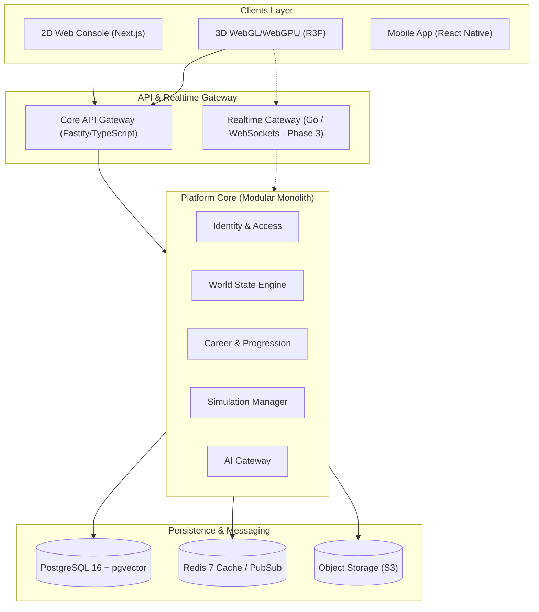

# Architecture Overview

Kynetra is architected as a **modular monolith** evolving toward distributed micro-engines only when required by computational or operational boundaries.

```mermaid
flowchart TB
    subgraph Clients["Clients Layer"]
        W2D["2D Web Console (Next.js)"]
        W3D["3D WebGL/WebGPU (R3F)"]
        MOB["Mobile App (React Native)"]
    end

    subgraph Gateway["API & Realtime Gateway"]
        APIGW["Core API Gateway (Fastify/TypeScript)"]
        RTGW["Realtime Gateway (Go / WebSockets - Phase 3)"]
    end

    subgraph PlatformCore["Platform Core (Modular Monolith)"]
        AUTH["Identity & Access"]
        WORLD["World State Engine"]
        CAREER["Career & Progression"]
        SIM["Simulation Manager"]
        AIGW["AI Gateway"]
    end

    subgraph DataStore["Persistence & Messaging"]
        PG[("PostgreSQL 16 + pgvector")]
        RD[("Redis 7 Cache / PubSub")]
        S3[("Object Storage (S3)")]
    end

    W2D --> APIGW
    W3D --> APIGW
    W3D -.-> RTGW
    APIGW --> PlatformCore
    RTGW -.-> PlatformCore
    PlatformCore --> PG
    PlatformCore --> RD
    PlatformCore --> S3
```
